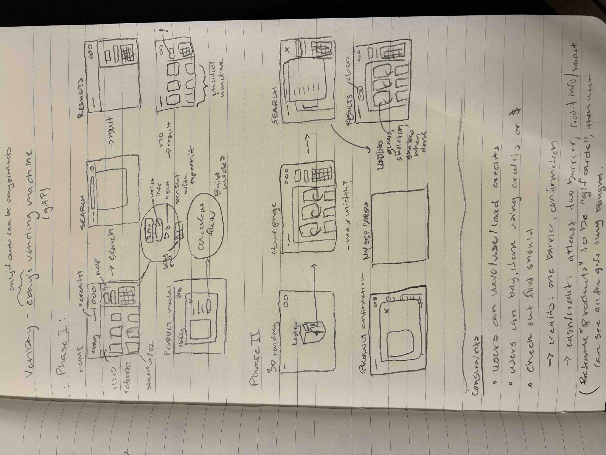
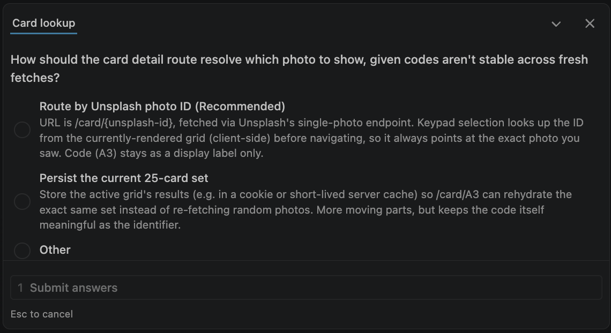

# General approach notes

The goal was to simulate a vending machine experience. At it's core, the interaction people make is the decision and action between the left and right column. Check out the vending-machine inspiration I pulled together: [express-combo.png](vending-machines/express-combo.png), [gettyimages-182720115.jpg](vending-machines/gettyimages-182720115.jpg), [woman-pushing-buttons.webp](vending-machines/woman-pushing-buttons.webp).

Early on, I found myself having to undo what was intuitive, like a dropshadow on hover on a card in the list. At first I had a click to open a modal, showing the card in someway. But I found that to be not so compelling and the concept of a card becames more blurry. Creating the card, like a card, warranted a dynamic card route. Which began the flow I committed to. I documented hour by hour in [time spent](documentation/noel-share/TIME-SPENT.md).

Highest level, I approached in a **PHASE I** (MVP) and PHASE II (REFINE) approach. My initial designs:

## Phase I

### checklist

- [x] 1. Build scaffold, figure out the correct install commands
- [x] 2. Build out header
- [x] 3. Build out left column card loop
- [x] 4. Build out right column vending machine components
- [x] 5. Build out search, be able to query
- [x] 6. Setup Storybook — 4 stories (Search, VendingMachine, Card, CardList), a11y addon, light/dark theme toolbar
- [x] 7. Setup unit + e2e tests — Vitest for `src/lib/*` (credits, card-cost, purchased-cards), Playwright for the dial → dispense → showcase/throw-away and credit top-up flows
- [x] 8. Setup how to manage data — Unsplash fetch + caching via middleware, purchases/credits in localStorage
- [x] 9. Purchasing interaction — keypad-driven, `/card/{id}` detail route, credit-gated, dials lock in once a code is preset
- [x] 10. `/my-cards` route showing purchased cards, each with a menu to showcase (`/my-cards/{index}`, centered/angled display) or throw away (confirm modal)
- [x] 11. Credits top-up — modal with a fake card/Apple Pay flow, caps at 100
- [x] 12. Make a pass at code clean-up, optimization, review.

Here is the final flow, [dial-and-dispense loop](https://claude.ai/artifact/7ufTLdjJxzymgHoigyLsbZ).

### Stack choices

- Marko + `@marko/run` (file-based routing) + `@marko/vite`, per the take-home test's requirement to use eBay's own framework.
- `npm create marko` was scaffolded manually (the blog-post-era `marko-run` create command is dead; current command is `npm create marko`).
- Plain CSS + CSS variables throughout, no preprocessor yet. No CSS/UI libraries anywhere (needs to satisfy the take-home spec's explicit requirement).
- Unsplash integration, needed to follow API rules

### Card grid

Since cards are ordered by A -> E and 1 -> 5, I felt the rows needed too...not wrap. Which meant each row needed to scroll independently and the overflow needed to be handled.

Working on mobile, I found that I needed to finesse responsiveness at certain viewports minimally. Accounting for most sizes, but not extra wide screens.

### Cards and the dial keypad

I reinforced the connection that when hovering over an item is not what the user ultimately wants to do in order to select a card. I added more fun visual affordance with a stroke/sparkles, simplified the interaction when hover-selecting via card and regular hover on the keypad when in different states.

Once a card's detail page loads with a code already dialed in, the row/col keys lock — they're display-only at that point, and dispense is immediately ready, since re-dialing on that screen wouldn't do anything useful. I also ported over a sparkle effect (originally a React/framer-motion component of mine) onto the active/hovered keypad letters and numbers, as a small reward for landing on a selection.

### Credits, insufficient funds, and topping up

Once credit-gating existed such as a insufficient funds scenario, I added a top-up modal (fake card entry + a fake Apple Pay flow with a QR code — no real payment processing, this is a prototype) that lets a user add credits up to a 100 cap. The hint text under the credit display switches between a neutral "Need more credits?" link and a more urgent "You need more credits" when the user doesn't have enough to cover any card amount.

### My Cards — showcase & throw away

`/my-cards` originally had a plain discard button per card. Replaced it with a ⋮ menu (matching the card's own visual language rather than sitting outside it) offering two actions: throw away, which now confirms via a modal instead of deleting instantly, and showcase, a new `/my-cards/{index}` route that displays the card centered with an angled tilt/shadow for a bit of presentation. The user needed something to do with the card after purchasing.

### The click-modal → keypad-driven purchase flow pivot

This was the biggest direction change in the session, worth flagging explicitly:

- **Original build**: clicking a card opened a modal (image, stats, "enter this code on the keypad" prompt).
- **Rethink**: the modal felt disconnected from the real interaction being a vending machine. Purchasing is driven by the physical keypad, and only one card can be "dialed" at a time. A modal per card didn't reflect that.
- **New flow**: clicking a card no longer opens anything — it only sets a cosmetic highlight on the matching keypad cell (a stroked outline, not a fill), and that highlight later moved from click-triggered to **hover-triggered** (renamed "click-selected" → "hover-selected" to make clear it's a preview, not a selection). Completing an actual keypad selection (both row and column pressed) is what navigates, to `/card/{unsplash-id}?code={code}`.

### Route-by-ID, not route-by-code

- Moving away from the modal, I considered keeping the row/col code itself as the URL (`/card/A3`) taking the Recommeded route, but the 25-card set is re-fetched fresh (random or search) on each request, so a given code doesn't reliably point at the same photo across loads.
- Decided to route by the underlying Unsplash photo ID instead (`/card/{id}`), with the code carried along only as a display label via a query param. Persisting the whole 25-card set was raised as an alternative and deliberately skipped for this prototype — Unsplash stays the source of truth, re-fetched fresh each load.

### Persistence

- Credits/purchased-cards persistence was decided early as localStorage-only (no backend), which held throughout. `/my-cards` reads a small shared helper (`src/lib/purchased-cards.ts`) on mount and reuses the existing `trading-card` component to render purchased items rather than building a separate display component.

### Light/dark theming

Tokens (`--bg-color`, `--text-color`, `--border-color`, `--hover-bg`) live in `src/styles/theme.css`, scoped under `:root` (light default) and `:root[data-theme="dark"]`. A header toggle button flips it: `document.documentElement.dataset.theme = "dark" | "light"`.

Getting `theme.css` into the live app took two failed attempts before landing:

- A `<link>` to it in the layout's `<head>` broke on nested routes (`/card/:id`) — the relative path resolves against the browser's current URL, not the source file, so it 404'd.
- Moving it into a `<script>` import broke immediately — `import` is only valid at a `.marko` file's root, not inside its compiled `<script>` block.
- Landed on duplicating the variables directly in the layout's own scoped `<style>` block for the live app, and keeping `theme.css` only for Storybook's `preview.ts` (a real module context where `import` works as expected). Not great, would love to learn how write once.

Everything themed also has to explicitly set `color`/`background` from those tokens — buttons and links don't inherit `body`'s color by default, so a few icon buttons silently ignored the theme until that got fixed.

### Per Claude on Storybook

- For Storybook's own light/dark toolbar control: `@storybook/marko`'s decorator plumbing is renderer-specific and its exact story-wrapping signature wasn't worth reverse-engineering. Used `globalTypes` (toolbar item) + a `loaders` hook in `preview.ts` that just sets `document.documentElement.dataset.theme = globals.theme` before each story renders — loaders are a plain pre-render side-effect hook supported identically across every Storybook renderer, so it sidesteps Marko-specific decorator composition entirely.
- The package README's documented setup command (`npx sb init --type marko --builder webpack5`) no longer works — current Storybook CLI dropped "marko" from its built-in `--type` list.
- Found `@storybook/marko-vite` by digging into the package's own test fixtures (not its README, which only documents webpack5), and set it up manually so Storybook shares the app's Vite toolchain instead of introducing a separate webpack build alongside it.

## Phase II

### Checklist

- [x] Incorporate parts of eBay's evo-web component library
- [x] 3D vending machine initial state that zooms into the app interface on interaction
- [ ] Make a accessibility audit, address issues.

## Incorporating 3D

Created the object using krea.ai, exported as `.glb`.

Rendering is hand-rolled `three` (`GLTFLoader`, no scene-management library) inside a single Marko tag (`machine-intro.marko`) driven by a `<lifecycle>` block — Marko owns mount/unmount, three.js owns the render loop in between.

Sequence, as a state machine on one `azimuth` value orbiting a fixed target:

- On mount: model loads, gets re-centered/scaled from its bounding box, drops onto a shadow-catching ground plane (`ShadowMaterial` + shadow-mapped directional light) so it doesn't look like it's floating.
- Idle: eases from a starting "profile" angle to a mirrored opposite-profile angle (ease-out-cubic tween on `azimuth`), rather than using `OrbitControls`' `autoRotate` — that hit a hard angle clamp and stopped abruptly, so I dropped `OrbitControls` and hand-rolled the orbit math (spherical coordinates around a fixed look-at target) to get an eased settle instead.
- Drag: plain pointer events rotate `azimuth` directly; release always eases back to the resting end-profile, not wherever the user left it.
- Wheel: small clamped zoom, independent of rotation.
- "Enter venbay" click: captures the camera's *live* position (whatever profile/drag state it's in) and eases it toward a close front-on framing, cross-fading the whole overlay's opacity out as it settles, then unmounts and hands off to the real homepage underneath.
- Renderer is alpha-transparent (no `scene.background`) so the venbay/eBay logo lockup — plain HTML/CSS behind the canvas — is visible through empty canvas space and gets naturally occluded by the model where they overlap, instead of drawing them as a texture in the 3D scene.

Considered eBay's own `evo-3d-viewer` (wraps Google's `<model-viewer>`, alpha component in `@evo-web/marko`) instead of hand-rolling — passed on it because it's a black-box element with only high-level attributes (`camera-orbit`, etc), not a scene graph you can script against, so it couldn't do the profile-tween/drag-spring-back/transparent-compositing choreography above.

## Using @ebay/skin

I didn't want to overhaul a ton of code but wanted to demonstrate my considerations of pulling in the ebay coreui. Implemented proof of concept code:

- Working, uses skin varialbes: `.vending-machine` border-radius now uses `var(--border-radius-50)`.
- Mismatch example: I implemented `data-theme="dark"` as a simple approach, but skin tokens key off of more sophisticated theme.
- I just incorporated the skin CSS, not the actual ebay marko components, which would greatly help with accessibility.

## Won't do

- [x] Fixing accessibility issue, most of them being color contrast
- [x] Build a robust checkout system
- [x] Sophisticated styling
